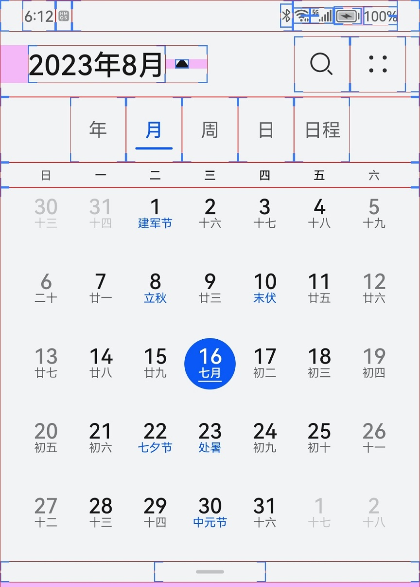

# uni-app x 的App性能优化

uni-app x 开发的Android App，本质是换了一种写法的原生应用，性能达到了原生水平。

但即便是原生开发者，使用传统的Android开发，如果代码写不好，也一样性能很差。

uni-app x 的Android开发，其性能优化和web开发有几处不同，需要注意：

## Android对dom的数量和层次更苛刻

dom数量越多，渲染越慢。

以日历为例，web开发一般是每天一个view，里面再嵌套农历、假日等，一个日历可能有几百个dom元素。如果Android上这么做，会非常卡。

那么原生Android开发怎么做的呢？使用Android的开发者模式审查元素边界，可以发现rom自带的日历，并不是每个格子一个view，而是整个月都是一个view。

Android上为了避免view数量过多，提供了原始的draw api，把线条和文字绘制上去。

在 uni-app x 中，也提供了同样的方法，允许开发者调用绘制API。

hello uni-app x 示例中，有一个日历的模板页面，就是通过draw api来绘制的，性能非常高。[源码详见](https://gitcode.net/dcloud/hello-uni-app-x/-/blob/master/pages/template/calendar/calendar.uvue)

尤其是组件作者，更需要关注dom数量的问题。

再举一个例子，uni-app x 内部开发基础组件时，第一个版本的slider组件，使用了7个view，利用view的移动和不同颜色view的width变化来实现。当页面中有slider较多时会变成很卡。

后来 slider组件改为 draw api 实现，只需要一个view。即使一个页面里有100个slider也非常丝滑。与许多原生应用相比，uni-app x的 slider组件性能更优秀。

uni-app x 还提供了工具帮助开发者监控页面的dom数量。

HBuilderX真机运行到Android时，每个页面进入时会都打印页面初始化的数据：dom数量、排版次数、渲染耗时等。

当然耗时数据不能以真机运行为准，调试基座因为热更新和sourcemap追踪等很多调试功能，导致性能比真实打包差。正式打包后性能更优。

国内应用大都不会采用google的Material Design组件，大多公司自己做组件。但这些组件库的质量层次不齐。可以说大部分国内原生应用自己做的组件库，没有uni-app x的组件性能高。

## 界面元素动画

动画，有2种，不跟随手势的固定动画，和跟随手势的动效。

固定动画使用css transition动画，或者使用 [animation-view组件](https://ext.dcloud.net.cn/plugin?id=10674)，这个组件本质是lottie动画。

跟随手势的动效，需要写逻辑代码。

uni-app x 中，没有通信阻塞，可以直接监听touch和滚动事件。不再需要renderjs、bindingx、wxs、worklet动画这些为了解决通信阻塞的补丁技术。

在touch和滚动事件中，移动dom元素时，有2个注意：
1. 请使用transform方式，而不是给dom的left/top/width/height等position参数重新赋值。这个在web开发也一样，直接改position参数不如使用transform。因为每次修改position参数都要过排版，而transform不用。
2. 请拿到dom的id/ref，调用js api操作，而不是通过模板style绑定data操作。因为操作data需要vue框架做diff对比，直接API操作则可以跳过vue框架。在touch和滚动中，16毫秒一帧才能达到最平滑的效果，多了几毫秒就可能掉帧。

在大多数开发框架中，因为通信性能问题，吸顶这个行为需要底层特殊封装。而 uni-app x 无需特别封装，直接监听滚动事件，通过dom的api以transform方式修改top值，就能自己编写逻辑控制在指定条件下实现固顶。

源码参考hello uni-app x中的吸顶示例，这充分体现了 uni-app x 引擎底层的通信性能多么优秀。[详见](https://gitcode.net/dcloud/hello-uni-app-x/-/blob/master/pages/template/scroll-sticky/scroll-sticky.uvue)

当然uni-app x已经封装了吸顶组件，使用更加便利。[详见](./component/sticky-header.md)

还有一个注意事项，当通过动画修改一个元素的高度或top值时，注意元素下部其他元素的联动反应。

比如上元素通过transform变高，虽然上元素的变化是平滑的，但下面的元素数量如果很多，且因为自动排版的原因，在不停的根据上元素变化而移动每个下面元素的top，这也会导致ui卡顿。

这个例子在折叠面板里存在，展开上面的折叠面板A时，推荐的做法是A的高度不做动画，直接变高，然后A的子元素以动画方式出现。看起来也有动效，且A下面的B、C、D等折叠面板元素只发生一次位移排版。

## 避免复杂逻辑卡UI

与小程序和uni-app不同，uni-app x下开发者的代码默认是在ui主线程运行的。除非单独写代码调用子进程或协程。

如果在ui繁忙时，比如页面进入动画时，开发者的代码做了很多耗时操作，会卡动画。原生开发也如此。

页面的onload触发，和进入动画是同时发生的，所以需注意onload生命周期中代码的编写。

由于uni-app x提供的联网和图片加载是在单独进程或协程中的，所以这2个行为不会卡ui。最佳实践是在onload里进行联网取数。

如果onload里某些代码卡了进入动画，也可以挪到页面的onready生命周期中，该事件触发的更晚一些。

页面dom元素过多的话，也会影响进入动画，所以尽量节省dom数量。

## 长列表

长列表，之所以成为性能关注点，是因为当列表item加载特别多时，持续增高的内存占用会导致越来越卡、应用崩溃。

原生开发一般使用recycle-view做复用，只保留有限的原生view，数屏以外的原生view做复用，即把列表中的数据只装载到部分的原生view中，并根据在屏状态，给原生view装载不同你发的列表数据。

uni-app x中，[list-view组件](./component/list-view.md)和[waterflow组件](./component/waterflow.md)，内部就是复用的。他们分别对应普通长列表和瀑布流长列表。

使用这2个组件，无论多长的列表，系统也会自动回收和复用渲染资源，和原生应用一样的体验，但开发更简单。

### 分批加载

一般联网加载的分页式列表，常规使用list-view组件或waterflow组件即可。

但如果需要一次性加载非常多的列表项，比如从本地一次性读取数千条记录，都想显示到界面上，那会非常卡。虽然在渲染层有复用，没有创建太多，但vue的VNode和UniElement超级多的话，创建也很慢。

一些开发者只是简单的把数千条数据赋值给vue的响应式变量，然后就会触发整体更新。这并不合理。

这种场景，应该使用分批加载。

分批加载没有封装具体的组件，hello uni-app-x内提供了一个示例[详见](https://gitcode.net/dcloud/hello-uni-app-x/-/blob/alpha/pages/template/long-list-batch/long-list-batch.uvue)

分批加载适用于初始要加载一大批数据的场景，针对这一大批数据延迟将数据分批渲染，进而优化页面初始化速度，防止页面跳转卡顿。

分批加载时需注意，用户在操作已经渲染的部分数据时，如果后台在持续加载数据，会导致卡住用户操作。
所以还需要做到闲时加载，避免卡UI。上述示例在用户滚动、下拉刷新期间会暂停分批加载。

如果数据太多，分批逐步加载完后，在低端机上出现爆内存现象，那可以使用下面的uni-recycle-view组件。

### uni-recycle-view组件

初始化大量列表项目，除了分批加载，还有一种方案是对VNode虚拟化，即只创建有限的VNode，进而实现DOM和原生View数量的整体控制。

插件市场已经封装了一个组件：[uni-recycle-view组件](https://ext.dcloud.net.cn/plugin?id=17385)

uni-recycle-view组件内部通过计算决定哪些数据需要在界面展示，默认展示当前滚动位置的所在屏及上下各5屏的数据。

同时它也有一些限制和注意事项：
1. uni-recycle-view 组件适用于仅使用一个for循环创建所有列表项的场景。
2. 由于该组件使用了scroll-view而不是list-view，滚动过程中自行计算哪些数据需要渲染和复用，并直接用原生recycle-View的效率要低，因此滚动流畅度低于list-view组件。
3. 该组件无法支持瀑布流

uni-recycle-view 组件相比分批加载，内存占用低一些。但在低端机上滚动流畅度低一些。可酌情使用。

无论如何，**注意列表项目里的组件数量**，它是dom元素的放大器。每个list-item里的dom数量多一点，乘以item数量，就会产生非常多dom，页面性能就很容易被拖垮。

比如很多列表有评星，如果使用一个5个view的评星组件，那每个list-item都会多5个view，列表一长dom数量会惊人。

在hello uni-app x的复杂长列表示例中，评星没有使用任何自定义组件，只是一个text组件里面使用字体图标放了5个字符，极大减少组件数量。[详见](https://gitcode.net/dcloud/hello-uni-app-x/-/blob/master/pages/template/long-list/long-list-page.uvue)

所以在列表中，尽量不使用层层封装的组件，直接使用内置组件更高效。

## 优化排版效率

HBuilderX真机运行到Android时，每个页面进入时会都打印页面初始化的数据：dom数量、排版次数、渲染耗时等。

但这个数值是调试模式的数值，发布打包后比这个数字更快。所以这个数字是用于开发期间的参考，而不能用于release包的性能评估。

dom数量优化前文已经讲了，那么如何优化排版效率？

1. 首先还是dom元素数量和层级，直接影响排版
2. 给dom元素指定明确的宽高，而不是很多自适应计算，可以提高排版效率。比如父节点未指定宽高，需要等所有子节点计算好宽高后把父节点撑开，这样就会比较低效。
3. 指定主轴方向的尺寸可以减少递归的深度
4. 文字测量属于耗时操作，给text组件指定宽高可以提升排版效率
5. 指定图片的尺寸信息可以减少排版次数
6. css单位尺寸性能比较，px > rpx > 百分比，使用百分比时父节点有明确宽高或者不依赖子节点确定宽高可以提升排版效率

## 控制vue的更新范围
vue的data更新时，会自动触发页面渲染更新。

更新是差量的，但计算差量也是耗费时间的。所以应减少对大data的修改。如果大data里有可能动态更新的小data，不如单独再存放一个小data数据。

另外更新ui时，如果vue框架能找到最小化组件，则会只更新该组件的渲染。所以尽量避免更新data引发大量ui重绘。\
比如长列表里有可点击的收藏按钮，点击后会动态更新收藏状态的数据，此时建议把收藏做一个单独的组件，这样某个item的收藏状态的更新，就不会触发整个列表的重绘。

## 避免不必要的组件抽象
有些时候我们会去创建组件来实现更好的抽象或代码组织。虽然这并没有什么问题，但请记住，创建太多组件实例将会导致性能损失。

需要提醒的是，只减少几个组件实例对于性能不会有明显的改善，所以如果一个用于抽象的组件在应用中只会渲染几次，就不用操心去优化它了。考虑这种优化的最佳场景还是在大型列表中。想象一下一个有 100 项的列表，每项的组件都包含许多子组件。在这里去掉一个不必要的组件抽象，可能会减少数百个组件实例的无谓性能消耗。

但无论如何，不应该对view、text这种大量使用的基础组件进行封装，大量使用封装的自定义组件很容易引发性能问题。

## 引擎体积

uni-app x的Android引擎体积为7.51M。
