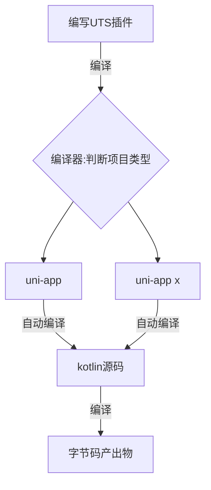
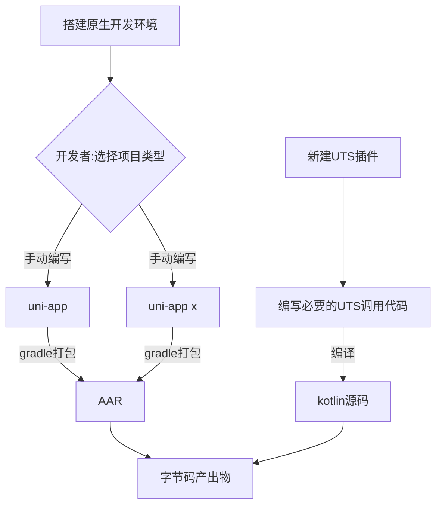

## 为什么要把原生插件迁移为UTS插件


+ 更大的使用范围

原生插件仅支持 uni-app 平台，UTS插件则同时支持 uni-app & uni-app x 双平台

+ 更好的性能

对于 uni-app x 项目: UTS插件不再通过 jsbridge 传递序列化数据的方式进行通讯，而是直接在原生语言形态中调用，可以让插件具备原生应用的性能

+ 更好的开发体验

插件开发和业务代码可以通过 HBuilder X 一站式完成，调试插件再也不需要切换IDE

+ 更丰富的API

UTS插件 内置了更多的API，还提供了更加友好的调用系统API的方式，插件能力更加丰富


关于原生插件和UTS插件的更多差异，可以查看
[文档](https://doc.dcloud.net.cn/uni-app-x/plugin/uts-plugin.html#uts%E6%8F%92%E4%BB%B6%E4%B8%8Euni%E5%8E%9F%E7%94%9F%E8%AF%AD%E8%A8%80%E6%8F%92%E4%BB%B6%E7%9A%84%E5%8C%BA%E5%88%AB)

UTS插件是对原生插件的一次全面升级，可以给插件开发者/使用者带来诸多好处。

本文将会以 [原生插件工程示例](https://nativesupport.dcloud.net.cn/NativePlugin/course/android.html)为例进行演示，帮助开发者实现原生插件到UTS插件的平滑迁移。

## module 插件迁移思路

常规的`UTS插件`开发过程是这样的：

+ 1 开发插件：开发者在HBuilder X 具体的项目中 编写UTS语言插件

+ 2 生成原生代码：UTS编译器 根据项目类别，将UTS语言编译成 符合 `uni-app` / `uni-app x` 平台规范的 kotlin 源码

+ 3 使用插件: 开发者在 业务代码中使用 UTS插件中导出的 函数/类/组件

+ 4  发布或运行应用：HBuilder X 提交打包，将生成的 业务代码和插件代码 编译整合




我们将`原生插件`转换为`UTS插件`的过程，实际是手动完成 步骤1 和 步骤2 并将产出物打包为AAR，作为外挂，添加进入UTS插件的过程

流程如下：




在已有原生插件的情况，我们需要做的事可以概述为：

删除 `uniModule`等规范约束，使其退化为原始的最基础的java class。再打包为 aar，供UTS插件代理调用


具体为下列实施步骤：

|序号|步骤|简介|
|:--|:--|:---|
|1|离线打包环境搭建|不同项目类型的依赖库添加|
|2|打包并集成AAR|将插件打包为 AAR 产出物形式，并添加到UTS插件中，供业务代码使用|
|3|编写调用代码|编写必要的UTS代码，调用AAR中的实现，注意:生命周期相关的代码也在这里手动实现|


## module 插件迁移实践

#### 离线打包环境搭建


前置环境：

+ java版本：17  

+ gradle 版本：8.2

+ compileSdk 33

+ kotlin:1.9.10


如果是 `uni-app`环境，添加下面的依赖

```gradle
	/**
     * uni-app 运行时能力
     */
    compileOnly fileTree(dir: '../app/libs', include: ['uniapp-v8-release.aar'])
    /**
     * 添加UTS语言能力
     */
    compileOnly fileTree(dir: '../app/libs', include: ['utsplugin-release.aar'])
```


如果是 `uni-app x`环境，添加下面的依赖

```gradle
/**
 * uni-app x运行时能力
 */
compileOnly fileTree(dir: '../app/libs', include: ['app-runtime-release.aar'])
/**
 * 添加UTS语言能力
 */
compileOnly fileTree(dir: '../app/libs', include: ['uts-runtime-release.aar'])
```


#### 改造操作

以`原生插件示例`为例，具体做了下面的改造工作:

+ 1 移除 uniModule  @UniJSMethod 注解

+ 2 UniJSCallback 平替为 UTSCallback. invokeAndKeepAlive/invoke 统一替换为 invoke

+ 3 系统声明周期API 平替为 UTSAndroid的api

比如: super.onActivityResult 移除，对应的功能实现，迁移到 UTS 插件中

+ 4 获取 Activity/Application 上下文的代码 替换为 UTSAndroid.INSTANCE.getUniActivity()


下面是修改完成后的 TestModule

```java
package io.dcloud.uniplugin;

import android.content.Intent;
import android.util.Log;
import com.alibaba.fastjson.JSONObject;
import io.dcloud.uts.UTSAndroid;
import io.dcloud.uts.UTSCallback;

public class TestModule  {

    String TAG = "TestModule";
    public static int REQUEST_CODE = 1000;

    public void testAsyncFunc(JSONObject options, UTSCallback callback) {
        Log.e(TAG, "testAsyncFunc--"+options);
        if(callback != null) {
            JSONObject data = new JSONObject();
            data.put("code", "success");
            callback.invoke(data);
        }
    }

    public JSONObject testSyncFunc(){
        JSONObject data = new JSONObject();
        data.put("code", "success");
        return data;
    }

    public void onActivityResult(int requestCode, int resultCode, Intent data) {
        if(requestCode == REQUEST_CODE && data.hasExtra("respond")) {
            Log.e("TestModule", "原生页面返回----"+data.getStringExtra("respond"));
        }
    }

    public void gotoNativePage(){
        if(UTSAndroid.INSTANCE.getUniActivity() != null) {
            Intent intent = new Intent(UTSAndroid.INSTANCE.getUniActivity(), NativePageActivity.class);
            UTSAndroid.INSTANCE.getUniActivity().startActivityForResult(intent, REQUEST_CODE);
        }
    }
}

```


将 uni-module 进行打包，得到 `uniplugin_module-release.aar`


在HBuilder X 中新建一个插件，充当代理作用，这里我们起名为`uts-module`。 现在的目录结构是这样的


编写必要的调用代码，另外插件生命周期监听也是在这里完成。这里是编写完毕的index.uts代码

```ts
import TestModule from 'io.dcloud.uniplugin.TestModule'
import JSONObject from 'com.alibaba.fastjson.JSONObject'
import Intent from 'android.content.Intent'

/**
 * 我们封装进AAR 里面的java 对象，通过操作它，我们可以调用原生实现的代码
 */
let testModule = TestModule()
/**
 * UTS是强类型语言，我们在这里声明了一个函数，用来承接系统的onActivityResult回调
 */
let resultCallback:((requestCode : Int, resultCode : Int, data ?: Intent)=>void)|null = null

/**
 * 对外暴露 uts_testAsyncFunc方法,实现直接调用AAR中的实现
 */
export function uts_testAsyncFunc(options:UTSJSONObject,callback: (ret:Any) => void) {
	testModule.testAsyncFunc(options.toJSONObject() as JSONObject,new UTSCallback(callback))
}
/**
 * 对外暴露uts_testSyncFunc方法,实现直接调用AAR中的实现
 */
export function uts_testSyncFunc():UTSJSONObject {
	let syncRet = testModule.testSyncFunc()
	return new UTSJSONObject(syncRet);
}
/**
 * 对外暴露uts_gotoNativePage方法
 */
export function uts_gotoNativePage(){
	
	/**
	 * 这里对onActivityResult 事件进行了监听
	 */
	let testModule = TestModule()
	resultCallback = (requestCode : Int, resultCode : Int, data ?: Intent) => {
		let eventName = "onAppActivityResult  -  requestCode:" + requestCode + " -resultCode:" + resultCode + " -data:" + JSON.stringify(data);
		console.log(eventName);
		UTSAndroid.offAppActivityResult(resultCallback)
		testModule.onActivityResult(requestCode,resultCode,data)
	}
	UTSAndroid.onAppActivityResult(resultCallback!);
	
	testModule.gotoNativePage()
}

```


在ext-module.vue 中使用插件:

```vue
<template>
	<div>
		<button type="primary" @click="testAsyncFunc">testAsyncFunc</button>
		<button type="primary" @click="testSyncFunc">testSyncFunc</button>
		<button type="primary" @click="gotoNativePage">跳转原生Activity</button>
	</div>
</template>

<script>
	/**
	 * 引入UTS函数
	 */
	import { uts_testAsyncFunc, uts_testSyncFunc,uts_gotoNativePage } from "../../uni_modules/uts-module";
	
	export default {
		onLoad() {
			plus.globalEvent.addEventListener('TestEvent', function(e){
				modal.toast({
					message: "TestEvent收到："+e.msg,
					duration: 1.5
				});
			});
		},
		methods: {
			testAsyncFunc() {
				// 调用异步方法
				uts_testAsyncFunc({
						'name': 'unimp',
						'age': 1
					},
					(ret) => {
						console.log("ret",ret)
						uni.showToast({
							title:ret
						})
					})
			},
			testSyncFunc() {
				// 调用同步方法
				var ret = uts_testSyncFunc({
					'name': 'unimp',
					'age': 1
				})
				console.log("testSyncFunc",ret)
				
			},
			gotoNativePage() {
				uts_gotoNativePage();
			}
		}
	}
</script>
```

运行测试功能正常，

至此我们完成了 Android原生插件中module 到 UTS插件的迁移工作

## component 迁移思路

component 插件的迁移思路和module插件不同。 

因为component存在更多的规范约束，我们只能选择将其彻底翻译为[UTS页面组件](https://doc.dcloud.net.cn/uni-app-x/plugin/uts-component.html)


## component 迁移实践

以 `uniplugin_component` 为例：

新建一个UTS页面组件，名称为:`uts-test-text`


+  修改 name字段为 `uts-test-text`

+  `emit` 添加 `ontel` 事件，特别注意: 事件名称必须要修改为全小写

+  声明 `tel` 属性，并在 `watch` 方法中监听属性变化

+  声明并对外暴露 `clearTel`方法

+  迁移 布局创建文件至 `NVLoad` 方法

这里修改后的 `index.uvue` 

```vue
<template>
  <view>
  </view>
</template>

<script lang="uts">
  
	import TextView from 'android.widget.TextView';
	import Color from 'android.graphics.Color';
	
	  export default {
		name: "uts-test-text",
		emits: ['ontel'],
		props: {
		  "tel": {
			type: String,
			default: ""
		  }
		},
		
		watch: {
		  "tel": {
			handler(newValue : string, oldValue : string) {
				this.$el?.setText(newValue);
				this.$emit('ontel')
			},
			immediate: true
		  },
		},
		expose: ['clearTel'],
		methods: {
		  clearTel() {
			 this.$el?.setText("");
		  },
		},
		
		NVLoad() : TextView {
		  let textView = new TextView(this.$androidContext);
		  textView.setTextSize(20.0.toFloat());
		  textView.setTextColor(Color.BLACK);
		  return textView;
		}
	  }
  
</script>

<style>

</style>
```

在nvue中使用该组件

```vue
<template>
	<div>
		<uts-test-text ref="telText" tel="12305" style="width:200rpx;height:100rpx" @ontel="onTelEvent" @click="myTextClick"></uts-test-text>
	</div>
</template>

<script>  
    export default {  
        data() {  
            return {  
            }  
        },  
        methods: {  
			onTelEvent(res) {
				console.log("onTelEvent=");
				console.log(res);
			},
			myTextClick(e) {
				console.log("myTextClick="+e);
				this.$refs.telText.clearTel();
			}
        }  
    }  
</script>  


```


至此，我们完成了 `component` 到UTS页面组件的迁移工作
