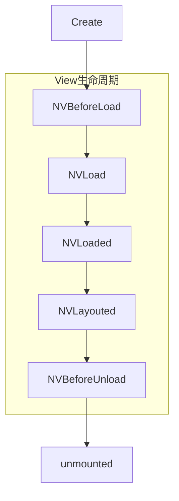

# uts插件 - uni-app兼容模式组件（原“组件插件”）开发

> HBuilderX3.6.18 及以上版本支持，app-harmony平台不支持此类型插件

本文重点在于讲述如何在app-android和app-ios上，将一个原生UI封装为兼容uni-app项目的UTS组件，供使用者在nvue/uvue页面template中以组件的方式调用。

## 前置条件

继续阅读文档前，开发者需要了解以下前置条件：

- 了解 `标准模式` 和 `uni-app兼容模式` 的差异，详情参考[uts组件开发概述](./uts-component.md)
- 了解 [uts语法](/uts/) 和 [uts原生插件](uts-plugin.md)
- 了解 [Vue组件](https://uniapp.dcloud.net.cn/tutorial/vue3-components.html)


## UTS组件结构解析

### UTS组件目录结构

<pre v-pre="" data-lang="">
	<code class="lang-" style="padding:0">
┌─common                      // 可跨端公用的uts代码。推荐，不强制
├─static                      // 静态资源
├─utssdk
│	├─app-android               //Android平台目录
│	│	├─assets                  //Android原生assets资源目录，可选
│	│	├─libs                    //Android原生库目录，可选
│	│	├─res                     //Android原生res资源目录，可选
│	│	├─AndroidManifest.xml     //Android原生应用清单文件，可选
│	│	├─config.json             //Android原生配置文件
│	│	├─index.uts               //Android原生插件能力实现，可选
|	|	└─index.vue               //Android原生组件能力实现，必选
│	├─app-ios                   //iOS平台目录
│	│	├─Frameworks              //iOS原生依赖的第三方 framework 依赖库存放目录，可选
│	│	├─Resources               //iOS原生所依赖的资源文件存放目录，可选
│	│	├─info.plist              //iOS原生所需要添加到主 info.plist 文件中的配置文件，可选
│	│	├─UTS.entitlements        //iOS原生所需要添加到主工程 .entitlements 文件中的配置文件，可选
│	│	├─config.json             //iOS原生配置文件
│	│	├─index.uts               //iOS原生插件能力实现，可选
|	|	└─index.vue               //iOS原生组件能力实现，必选
│	├─web                       //web平台目录
│	│	└─index.uts
│	├─mp-alipay                 // 支付宝小程序平台，可选
│	├─mp-baidu                  // 百度小程序平台，可选
│	├─mp-jd                     // 京东小程序平台（仅限vue2），可选
│	├─mp-kuaishou               // 快手小程序平台，可选
│	├─mp-lark                   // 飞书小程序平台，可选
│	├─mp-qq                     // QQ小程序平台，可选
│	├─mp-toutiao                // 抖音小程序平台，可选
│	├─mp-weixin                 // 微信小程序平台，可选
│	├─mp-xhs                    // 小红书小程序平台（仅限vue2），可选
│	└─index.uts                 // 跨平台插件能力实现，可选
└─package.json                // 插件清单文件
</code>
</pre>


如上所示，UTS组件的目录结构与UTS插件基本相同

唯一的差别在于，UTS组件入口文件有两个:

+ 必选的index.vue 组件入口

+ 可选的index.uts 函数能力入口


用户如果在开发组件的同时，存在一些与组件无关的能力需要对外暴露，可以在index.uts中进行实现

大多数情况下，我们只需要开发一个index.vue 即可，如果存在多个组件，可以新建多个 xxx.vue文件

关于 index.vue 源码如何编写，我们会在下一个章节介绍


### index.vue源码结构

下面是一个组件源码 index.vue 完整示例：

**注意**

- 目前UTS组件仅支持`export default {}`的选项式API，vue3的组合式API暂未支持。

::: preview

> Android

```html

<template>
  <view>
  </view>
</template>

<script lang="uts">
  /**
   * 引用 Android 系统库
   * [可选实现，按需引入]
   */
  import TextUtils from 'android.text.TextUtils';
  import Button from 'android.widget.Button';
  import View from 'android.view.View';

  /**
   * 引入三方库
   * [可选实现，按需引入]
   *
   * 在 Android 平台引入三方库有以下两种方式：
   * 1、[推荐] 通过 仓储 方式引入，将 三方库的依赖信息 配置到 config.json 文件下的 dependencies 字段下。详细配置方式[详见](https://uniapp.dcloud.net.cn/plugin/uts-plugin.html#dependencies)
   * 2、直接引入，将 三方库的aar或jar文件 放到libs目录下。更多信息[详见](https://uniapp.dcloud.net.cn/plugin/uts-plugin.html#android%E5%B9%B3%E5%8F%B0%E5%8E%9F%E7%94%9F%E9%85%8D%E7%BD%AE)
   *
   * 在通过上述任意方式依赖三方库后，使用时需要在文件中 import
   * import { LottieAnimationView } from 'com.airbnb.lottie.LottieAnimationView'
   */

  /**
   * UTSAndroid 为平台内置对象，不需要 import 可直接调用其API，[详见](https://uniapp.dcloud.net.cn/uts/utsandroid.html#utsandroid)
   */

  //原生提供以下属性或方法的实现
  export default {
    /**
     * 组件名称，也就是开发者使用的标签
     */
    name: "uts-hello-view",
    /**
     * 组件涉及的事件声明，只有声明过的事件，才能被正常发送
     */
    emits: ['buttonclick'],
    /**
     * 属性声明，组件的使用者会传递这些属性值到组件
     */
    props: {
      "buttontext": {
        type: String,
        default: "点击触发"
      }
    },
    /**
     * 组件内部变量声明
     */
    data() {
      return {}
    },
    /**
     * 属性变化监听器实现
     */
    watch: {
      "buttontext": {
        /**
         * 这里监听属性变化，并进行组件内部更新
         */
        handler(newValue : string, oldValue : string) {
          if (!TextUtils.isEmpty(newValue) && newValue != oldValue) {
            this.$el?.setText(newValue);
          }
        },
        immediate: false // 创建时是否通过此方法更新属性，默认值为false
      },
    },
    /**
     * 规则：如果没有配置expose，则methods中的方法均对外暴露，如果配置了expose，则以expose的配置为准向外暴露
     * ['publicMethod'] 含义为：只有 `publicMethod` 在实例上可用
     * 
     * 注意：如果在data中声明了一个变量，此时组件配置了 expose字段，但未在expose字段中包含此变量。会导致该变量被标记为`private`：仅能在组件内使用，不能在组件外访问
     */
    expose: ['doSomething'],
    methods: {
      /**
       * 对外公开的组件方法
       *
       * uni-app中调用示例：
       * this.$refs["组件ref"].doSomething("uts-button");
       *
       * uni-app x中调用示例：
       * 1、引入对应Element
       * import { UtsButtonElement(组件名称以upper camel case方式命名 + Element) } from 'uts.sdk.modules.utsComponent(组件目录名称以lower camel case方式命名)';
       * 2、(this.$refs["组件ref"] as UtsButtonElement).doSomething("uts-button");
       * 或 (uni.getElementById("组件id") as UtsButtonElement).doSomething("uts-button");
       */
      doSomething(param : string) {
        console.log(param);
      },
      /**
       * 内部使用的组件方法
       */
      privateMethod() {

      }
    },
    /**
     * [可选实现] 组件被创建，组件第一个生命周期，
     * 在内存中被占用的时候被调用，开发者可以在这里执行一些需要提前执行的初始化逻辑
     */
    created() {

    },
    /**
     * [可选实现] 对应平台的view载体即将被创建，对应前端beforeMount
     */
    NVBeforeLoad() {

    },
    /**
     * [必须实现] 创建原生View，必须定义返回值类型
     * 开发者需要重点实现这个函数，声明原生组件被创建出来的过程，以及最终生成的原生组件类型
     * （Android需要明确知道View类型，需特殊校验）
     */
    NVLoad() : Button {
      let button = new Button($androidContext!);
      button.setText("点击触发");
      button.setOnClickListener(new ButtonClickListener(this));
      return button;
    },
    /**
     * [可选实现] 原生View已创建
     */
    NVLoaded() {

    },
    /**
     * [可选实现] 原生View布局完成
     */
    NVLayouted() {

    },
    /**
     * [可选实现] 原生View将释放
     */
    NVBeforeUnload() {

    },
    /**
     * [可选实现] 原生View已释放，这里可以做释放View之后的操作
     */
    NVUnloaded() {

    },
    /**
     * [可选实现] 组件销毁
     */
    unmounted() {

    },
    /**
     * [可选实现] 自定组件布局尺寸，用于告诉排版系统，组件自身需要的宽高
     * 一般情况下，组件的宽高应该是由终端系统的排版引擎决定，组件开发者不需要实现此函数
     * 但是部分场景下，组件开发者需要自己维护宽高，则需要开发者重写此函数
     */
    NVMeasure(size : UTSSize,mode:UTSMeasureMode) : UTSSize {
      // size.width = 300.0.toFloat();
      // size.height = 200.0.toFloat();
      return size;
    }
  }

  /**
   * 定义按钮点击后触发回调的类
   * [可选实现]
   */
  class ButtonClickListener extends View.OnClickListener {
    /**
     * 如果需要在回调类或者代理类中对组件进行操作，比如调用组件方法，发送事件等，需要在该类中持有组件对应的原生类的对象
     * 组件原生类的基类为 UTSComponent，该类是一个泛型类，需要接收一个类型变量，该类型变量就是原生组件的类型
     */
    private comp : UTSComponent<Button>;

    constructor(comp : UTSComponent<Button>) {
      super();
      this.comp = comp;
    }

    /**
     * 按钮点击回调方法
     */
    override onClick(v ?: View) {
      console.log("按钮被点击");
      // 发送事件
      this.comp.$emit("buttonclick");
    }
  }
</script>

<style>

</style>

```

> iOS

```html
<template>
  <view class="defaultStyles">
  </view>
</template>
<script lang="uts">
  /**
   * 引用 iOS 系统库
   * [可选实现，按需引入]
   */
  import {
    UIButton,
    UIControl
  } from "UIKit"

  /**
   * 引入三方库
   * [可选实现，按需引入]
   *
   * 在 iOS 平台引入三方库有以下两种方式：
   * 1、通过引入三方库framework 或者.a 等方式，需要将 .framework 放到 ./Frameworks 目录下，将.a 放到 ./Libs 目录下。更多信息[详见](https://uniapp.dcloud.net.cn/plugin/uts-plugin.html#ios-平台原生配置)
   * 2、通过 cocoaPods 方式引入，将要引入的 pod 信息配置到 config.json 文件下的 dependencies-pods 字段下。详细配置方式[详见](https://uniapp.dcloud.net.cn/plugin/uts-ios-cocoapods.html)
   *
   * 在通过上述任意方式依赖三方库后，使用时需要在文件中 import:
   * 示例：import { LottieAnimationView, LottieAnimation, LottieLoopMode	} from 'Lottie'
   */

  /**
   * UTSiOS、UTSComponent 为平台内置对象，不需要 import 可直接调用其API，[详见](https://uniapp.dcloud.net.cn/uts/utsios.html)
   */
  import { UTSComponent } from "DCloudUTSFoundation"

  //原生提供以下属性或方法的实现
  export default {
    data() {
      return {
      };
    },
    /**
     * 组件名称，也就是开发者使用的标签
     */
    name: "uts-hello-view",
    /**
     * 组件涉及的事件声明，只有声明过的事件，才能被正常发送
     */
    emits: ['buttonclick'],
    /**
     * 属性声明，组件的使用者会传递这些属性值到组件
     */
    props: {
      /**
       * 字符串类型 属性：buttontext  需要设置默认值
       */
      "buttontext": {
        type: String,
        default: "点击触发"
      }
    },
    /**
     * 组件内部变量声明
     */

    /**
     * 属性变化监听器实现
     */
    watch: {
      "buttontext": {
        /**
         * 这里监听属性变化，并进行组件内部更新
         */
        handler(newValue : String, oldValue : String) {
          this.$el.setTitle(newValue, for = UIControl.State.normal)
        },
        /**
         * 创建时是否通过此方法更新属性，默认值为false
         */
        immediate: false
      },
    },
    /**
     * 规则：如果没有配置expose，则methods中的方法均对外暴露，如果配置了expose，则以expose的配置为准向外暴露
     * ['publicMethod'] 含义为：只有 `publicMethod` 在实例上可用
     */
    expose: ['doSomething'],
    methods: {
      /**
       * 对外公开的组件方法
       * 在uni-app中调用组件方法，可以通过指定ref的方式，例如指定uts-button 标签的ref 为 ’button‘， 调用时使用：this.$refs["button"].doSomething('message');
       */
      doSomething(paramA : string) {
        // 这是组件的自定义方法
        console.log(paramA, 'this is in uts-button component')
      },


      /**
       * 内部使用的组件方法
       */
    },


    /**
     * 组件被创建，组件第一个生命周期，
     * 在内存中被占用的时候被调用，开发者可以在这里执行一些需要提前执行的初始化逻辑
     * [可选实现]
     */
    created() {

    },
    /**
     * 对应平台的view载体即将被创建，对应前端beforeMount
     * [可选实现]
     */
    NVBeforeLoad() {

    },
    /**
     * 创建原生View，必须定义返回值类型
     * 开发者需要重点实现这个函数，声明原生组件被创建出来的过程，以及最终生成的原生组件类型
     * [必须实现]
     */
    NVLoad() : UIButton {
      //必须实现
      buttonClickListsner = new ButtonClickListsner(this)

      let button = new UIButton()
      button.setTitle(this.buttontext, for = UIControl.State.normal)
      // 在 swift target-action 对应的方法需要以OC的方式来调用，那么OC语言中用Selector来表示一个方法的名称（又称方法选择器），创建一个Selector可以使用 Selector("functionName") 的方式。
      const method = Selector("buttonClickAction")
      if (buttonClickListsner != null) {
        button.addTarget(buttonClickListsner!, action = method, for = UIControl.Event.touchUpInside)
      }
      return button
    },

    /**
     * 原生View已创建
     * [可选实现]
     */
    NVLoaded() {
      /**
       * 通过 this.$el 来获取原生控件。
       */
      this.$el.setTitle(this.buttontext, for = UIControl.State.normal)
    },
    /**
     * 原生View布局完成
     * [可选实现]
     */
    NVLayouted() {

    },
    /**
     * 原生View将释放
     * [可选实现]
     */
    NVBeforeUnload() { },
    /**
     * 原生View已释放，这里可以做释放View之后的操作
     * [可选实现]
     */
    NVUnloaded() {

    },
    /**
     * 组件销毁
     * [可选实现]
     */
    unmounted() { }

    /**
     * 更多组件开发的信息详见：https://uniapp.dcloud.net.cn/plugin/uts-component.html
     */
  }

  /**
   * 定义按钮点击后触发回调的类
   * [可选实现]
   */
  class ButtonClickListsner {
    /**
     * 如果需要在回调类或者代理类中对组件进行操作，比如调用组件方法，发送事件等，需要在该类中持有组件对应的原生类的对象。
     * 组件原生类的基类为 UTSComponent，该类是一个泛型类，需要接收一个类型变量，该类型变量就是原生组件的类型。
     */
    private component : UTSComponent<UIButton>

    constructor(component : UTSComponent<UIButton>) {
      this.component = component
      super.init()
    }

    /**
     * 按钮点击回调方法
     * 在 swift 中，所有target-action (例如按钮的点击事件，NotificationCenter 的通知事件等)对应的 action 函数前面都要使用 @objc 进行标记。
     * [可选实现]
     */
    @objc buttonClickAction() {
      console.log("按钮被点击")
      // 发送事件
      this.component.__$$emit("buttonclick");
    }
  }

  /**
   * 定义回调类或者代理类的实例
   * [可选实现]
   */
  let buttonClickListsner : ButtonClickListsner | null = null
</script>

<style>

</style>
```

:::

index.vue 要素可以分为以下几类：

+ 配置：

	name：组件的使用标签，可以省略，若省略则默认为组件名称

	emits：组件允许的消息事件名称，如果没有组件消息，不需要配置

+ 属性：

	props：需要由组件的使用者提供，比如一个Image组件，会需要一个path属性作为图像路径来源

	watch：属性的监听实现，用来监听属性数据更新。

+ 数据：

	data：组件内部数据定义，用于组件内部逻辑处理，不对外暴露

+ 方法：

	methods：组件方法定义，可以通过与expose组合使用，区分对内方法和对外方法

	expose：与methods 字段配合使用，用以区分组件对内方法和对外方法


+ 生命周期：

	组件需要重点处理 内存创建/销毁，View载体创建/销毁 过程中的资源管理，具体参考生命周期章节

+ 内置对象：

	为了方便组件开发者，UTS组件内置了部分变量与函数，具体参考内置对象与函数章节


### 生命周期

组件开发者需要重点关注组件的生命周期，以便进行资源的初始化和回收



|函数名			|描述				|建议行为		|是否可选	|
|:----			|:---				|:---			|:---		|
|created		|组件在内存中被创建	|开发者可以在这里执行一些需要最早执行的初始化逻辑|可选|
|NVBeforeLoad	|组件对应平台的view载体，即将被创建|开发者可以在这里执行一些需要在View创建前初始化的逻辑|可选|
|NVLoad			|组件view载体正在被创建实现|开发者需要重点实现这个函数，声明原生组件被创建出来的过程，以及最终生成的原生组件类型|必须实现|
|NVLoaded			|组件view载体创建完成|需要在对应的原生view创建完成后执行的逻辑|可选|
|NVLayouted		|组件对应平台的view载体已布局结束	|需要在view布局结束后执行的逻辑	|可选|
|NVBeforeUnload	|view载体即将被卸载				|View卸载前，需要回收资源的逻辑	|可选|
|NVUnloaded		|view载体已经被卸载				|View卸载后，需要回收资源的逻辑	|可选|
|unmounted		|组件在内存被销毁				|资源回收逻辑					|可选|


除上述生命周期外，还存在下列可选周期函数：

+ NVMeasure

NVMeasure 用于告诉排版系统，组件自身需要的宽高，具体的调用时机由排版系统决定。

一般情况下，组件的宽高应该是由终端系统的排版引擎决定，组件开发者不需要实现此函数。

但是部分场景下，组件开发者需要自己维护宽高，则需要开发者重写此函数


注意:

    + 只有非容器组件生效，容器组件不应该重写此函数

    + HBuilder X 4.25 版本后新增 `UTSMeasureMode` 类型入参，包含组件宽高在css中的设定： 0 代表未指定css中的宽高属性 / 1 代表已指定css中的宽高属性


+ NVUpdateStyles

需要HBuilder X 3.96版本

NVUpdateStyles 用来监听组件的外部style 变化，通常用来写响应外部的css样式变化从而动态更新组件内部状态场景

我们可以在组件内部这样实现:

```uts
NVUpdateStyles(styles: Map<String, any>){
	console.log("NVUpdateStyles",styles)
}
```

+ NVRecycler 

HBuilderX 4.0版本起支持，仅uni-app x App-Android平台支持

当UTS组件在`list-view`组件中使用时，由于[复用机制](../component/list-view.md)，UTS组件可能表现异常（UI、事件回调等），因此，组件开发者需要在此函数中进行相应的逻辑处理。

比如我们使用UTS组件封装了一个Android原生的`EditText`控件（输入框），代码如下

```html
NVLoad() : EditText {
	let editText = new EditText($androidContext!);
	return editText;
}
```

然后我们在`list-view`组件中使用该UTS组件，当我们在第一个输入框中随机输入几个字符后，开始滚动列表，会发现之前输入的字符又出现在下面某个`list-item`中，这就是一个典型的由于复用机制导致的UI状态异常问题。此时我们就需要在NVRecycler()函数中处理该问题，代码如下

```html
NVRecycler() {
	// 发生复用时置空输入框内容
	this.$el?.setText("")
}
```

[vue3 生命周期暂不支持](https://uniapp.dcloud.net.cn/tutorial/vue3-api.html#%E9%80%89%E9%A1%B9-%E7%94%9F%E5%91%BD%E5%91%A8%E6%9C%9F%E9%92%A9%E5%AD%90)


### 内置对象和函数

为了方便组件开发者使用，UTS 组件内部内置了下列对象：

|变量名			|类型		|简介				|平台限制	|方法&属性	|
|:-------		|:--------	|:--------			|:---		|:---			|
|$el			|对象		|当前View实例对象	|全部平台	|开发者在NVLoad返回的对象类型|
|$androidContext|对象		|当前组件上下文(可为空)		|仅android	|android平台对应Context对象|
|$emit("event",Any)|函数		|发送已注册的事件	|全部平台	|$emit(事件名称-必选,事件参数可选)|

**注意**

`UTSAndroid.getUniActivity()/UTSAndroid.getAppContext()` 在组件内不建议使用，请使用`$androidContext`来替代


### 通用事件

对于UTS组件来说，除了通过 $emit/emits 函数来自定义组件事件外，UTS组件还内置了下列通用事件：


|事件名称			|简介
|:-------			|:--------
|click				|组件点击事件响应
|longpress			|组件长按事件响应


通用事件，组件的使用者无需实现，直接使用

```html
<uts-hello-view buttonClick="自定义事件处理函数" click="通用点击事件处理函数" longpress="通用长按事件处理函数"/>
```


## 简单View的示例

本章节以 一个极简的组件开发为例，介绍说明UTS组件开发流程

### 创建插件

在HBuilder X 中选中Uni-App项目下 uni_modules目录,右键选择新建`uni_modules插件`


这是创建后的目录结构


### 编写逻辑

打开index.vue，键入下面的组件源码:

::: preview

> Android

```html

<template>
  <view>
  </view>
</template>

<script lang="uts">
  /**
   * 引用 Android 系统库
   * [可选实现，按需引入]
   */
  import TextUtils from 'android.text.TextUtils';
  import Button from 'android.widget.Button';
  import View from 'android.view.View';

  /**
   * 引入三方库
   * [可选实现，按需引入]
   *
   * 在 Android 平台引入三方库有以下两种方式：
   * 1、[推荐] 通过 仓储 方式引入，将 三方库的依赖信息 配置到 config.json 文件下的 dependencies 字段下。详细配置方式[详见](https://uniapp.dcloud.net.cn/plugin/uts-plugin.html#dependencies)
   * 2、直接引入，将 三方库的aar或jar文件 放到libs目录下。更多信息[详见](https://uniapp.dcloud.net.cn/plugin/uts-plugin.html#android%E5%B9%B3%E5%8F%B0%E5%8E%9F%E7%94%9F%E9%85%8D%E7%BD%AE)
   *
   * 在通过上述任意方式依赖三方库后，使用时需要在文件中 import
   * import { LottieAnimationView } from 'com.airbnb.lottie.LottieAnimationView'
   */

  /**
   * UTSAndroid 为平台内置对象，不需要 import 可直接调用其API，[详见](https://uniapp.dcloud.net.cn/uts/utsandroid.html#utsandroid)
   */

  //原生提供以下属性或方法的实现
  export default {
    /**
     * 组件名称，也就是开发者使用的标签
     */
    name: "uts-hello-view",
    /**
     * 组件涉及的事件声明，只有声明过的事件，才能被正常发送
     */
    emits: ['buttonclick'],
    /**
     * 属性声明，组件的使用者会传递这些属性值到组件
     */
    props: {
      "buttontext": {
        type: String,
        default: "点击触发"
      }
    },
    /**
     * 组件内部变量声明
     */
    data() {
      return {}
    },
    /**
     * 属性变化监听器实现
     */
    watch: {
      "buttontext": {
        /**
         * 这里监听属性变化，并进行组件内部更新
         */
        handler(newValue : string, oldValue : string) {
          if (!TextUtils.isEmpty(newValue) && newValue != oldValue) {
            this.$el?.setText(newValue);
          }
        },
        immediate: false // 创建时是否通过此方法更新属性，默认值为false
      },
    },
    /**
     * 规则：如果没有配置expose，则methods中的方法均对外暴露，如果配置了expose，则以expose的配置为准向外暴露
     * ['publicMethod'] 含义为：只有 `publicMethod` 在实例上可用
     */
    expose: ['doSomething'],
    methods: {
      /**
       * 对外公开的组件方法
       *
       * uni-app中调用示例：
       * this.$refs["组件ref"].doSomething("uts-button");
       *
       * uni-app x中调用示例：
       * 1、引入对应Element
       * import { UtsButtonElement(组件名称以upper camel case方式命名 + Element) } from 'uts.sdk.modules.utsComponent(组件目录名称以lower camel case方式命名)';
       * 2、(this.$refs["组件ref"] as UtsButtonElement).doSomething("uts-button");
       * 或 (uni.getElementById("组件id") as UtsButtonElement).doSomething("uts-button");
       */
      doSomething(param : string) {
        console.log(param);
      },
      /**
       * 内部使用的组件方法
       */
      privateMethod() {

      }
    },
    /**
     * [可选实现] 组件被创建，组件第一个生命周期，
     * 在内存中被占用的时候被调用，开发者可以在这里执行一些需要提前执行的初始化逻辑
     */
    created() {

    },
    /**
     * [可选实现] 对应平台的view载体即将被创建，对应前端beforeMount
     */
    NVBeforeLoad() {

    },
    /**
     * [必须实现] 创建原生View，必须定义返回值类型
     * 开发者需要重点实现这个函数，声明原生组件被创建出来的过程，以及最终生成的原生组件类型
     * （Android需要明确知道View类型，需特殊校验）
     */
    NVLoad() : Button {
      let button = new Button($androidContext!);
      button.setText("点击触发");
      button.setOnClickListener(new ButtonClickListener(this));
      return button;
    },
    /**
     * [可选实现] 原生View已创建
     */
    NVLoaded() {

    },
    /**
     * [可选实现] 原生View布局完成
     */
    NVLayouted() {

    },
    /**
     * [可选实现] 原生View将释放
     */
    NVBeforeUnload() {

    },
    /**
     * [可选实现] 原生View已释放，这里可以做释放View之后的操作
     */
    NVUnloaded() {

    },
    /**
     * [可选实现] 组件销毁
     */
    unmounted() {

    },
    /**
     * [可选实现] 自定组件布局尺寸，用于告诉排版系统，组件自身需要的宽高
     * 一般情况下，组件的宽高应该是由终端系统的排版引擎决定，组件开发者不需要实现此函数
     * 但是部分场景下，组件开发者需要自己维护宽高，则需要开发者重写此函数
     * 
     * HBuilder X 4.25 版本后新增 UTSMeasureMode 参数
     */
    NVMeasure(size : UTSSize,mode:UTSMeasureMode) : UTSSize {
      // size.width = 300.0.toFloat();
      // size.height = 200.0.toFloat();
      return size;
    }
  }

  /**
   * 定义按钮点击后触发回调的类
   * [可选实现]
   */
  class ButtonClickListener extends View.OnClickListener {
    /**
     * 如果需要在回调类或者代理类中对组件进行操作，比如调用组件方法，发送事件等，需要在该类中持有组件对应的原生类的对象
     * 组件原生类的基类为 UTSComponent，该类是一个泛型类，需要接收一个类型变量，该类型变量就是原生组件的类型
     */
    private comp : UTSComponent<Button>;

    constructor(comp : UTSComponent<Button>) {
      super();
      this.comp = comp;
    }

    /**
     * 按钮点击回调方法
     */
    override onClick(v ?: View) {
      console.log("按钮被点击");
      // 发送事件
      this.comp.$emit("buttonclick");
    }
  }
</script>

<style>

</style>

```

> iOS

```html
<template>
  <view class="defaultStyles">
  </view>
</template>
<script lang="uts">
  /**
   * 引用 iOS 系统库
   * [可选实现，按需引入]
   */
  import {
    UIButton,
    UIControl
  } from "UIKit"

  /**
   * 引入三方库
   * [可选实现，按需引入]
   *
   * 在 iOS 平台引入三方库有以下两种方式：
   * 1、通过引入三方库framework 或者.a 等方式，需要将 .framework 放到 ./Frameworks 目录下，将.a 放到 ./Libs 目录下。更多信息[详见](https://uniapp.dcloud.net.cn/plugin/uts-plugin.html#ios-平台原生配置)
   * 2、通过 cocoaPods 方式引入，将要引入的 pod 信息配置到 config.json 文件下的 dependencies-pods 字段下。详细配置方式[详见](https://uniapp.dcloud.net.cn/plugin/uts-ios-cocoapods.html)
   *
   * 在通过上述任意方式依赖三方库后，使用时需要在文件中 import:
   * 示例：import { LottieAnimationView, LottieAnimation, LottieLoopMode	} from 'Lottie'
   */

  /**
   * UTSiOS、UTSComponent 为平台内置对象，不需要 import 可直接调用其API，[详见](https://uniapp.dcloud.net.cn/uts/utsios.html)
   */
  import { UTSComponent } from "DCloudUTSFoundation"

  //原生提供以下属性或方法的实现
  export default {
    data() {
      return {
      };
    },
    /**
     * 组件名称，也就是开发者使用的标签
     */
    name: "uts-hello-view",
    /**
     * 组件涉及的事件声明，只有声明过的事件，才能被正常发送
     */
    emits: ['buttonclick'],
    /**
     * 属性声明，组件的使用者会传递这些属性值到组件
     */
    props: {
      /**
       * 字符串类型 属性：buttontext  需要设置默认值
       */
      "buttontext": {
        type: String,
        default: "点击触发"
      }
    },
    /**
     * 组件内部变量声明
     */

    /**
     * 属性变化监听器实现
     */
    watch: {
      "buttontext": {
        /**
         * 这里监听属性变化，并进行组件内部更新
         */
        handler(newValue : String, oldValue : String) {
          this.$el.setTitle(newValue, for = UIControl.State.normal)
        },
        /**
         * 创建时是否通过此方法更新属性，默认值为false
         */
        immediate: false
      },
    },
    /**
     * 规则：如果没有配置expose，则methods中的方法均对外暴露，如果配置了expose，则以expose的配置为准向外暴露
     * ['publicMethod'] 含义为：只有 `publicMethod` 在实例上可用
     */
    expose: ['doSomething'],
    methods: {
      /**
       * 对外公开的组件方法
       * 在uni-app中调用组件方法，可以通过指定ref的方式，例如指定uts-button 标签的ref 为 ’button‘， 调用时使用：this.$refs["button"].doSomething('message');
       */
      doSomething(paramA : string) {
        // 这是组件的自定义方法
        console.log(paramA, 'this is in uts-button component')
      },


      /**
       * 内部使用的组件方法
       */
    },


    /**
     * 组件被创建，组件第一个生命周期，
     * 在内存中被占用的时候被调用，开发者可以在这里执行一些需要提前执行的初始化逻辑
     * [可选实现]
     */
    created() {

    },
    /**
     * 对应平台的view载体即将被创建，对应前端beforeMount
     * [可选实现]
     */
    NVBeforeLoad() {

    },
    /**
     * 创建原生View，必须定义返回值类型
     * 开发者需要重点实现这个函数，声明原生组件被创建出来的过程，以及最终生成的原生组件类型
     * [必须实现]
     */
    NVLoad() : UIButton {
      //必须实现
      buttonClickListsner = new ButtonClickListsner(this)

      let button = new UIButton()
      button.setTitle(this.buttontext, for = UIControl.State.normal)
      // 在 swift target-action 对应的方法需要以OC的方式来调用，那么OC语言中用Selector来表示一个方法的名称（又称方法选择器），创建一个Selector可以使用 Selector("functionName") 的方式。
      const method = Selector("buttonClickAction")
      if (buttonClickListsner != null) {
        button.addTarget(buttonClickListsner!, action = method, for = UIControl.Event.touchUpInside)
      }
      return button
    },

    /**
     * 原生View已创建
     * [可选实现]
     */
    NVLoaded() {
      /**
       * 通过 this.$el 来获取原生控件。
       */
      this.$el.setTitle(this.buttontext, for = UIControl.State.normal)
    },
    /**
     * 原生View布局完成
     * [可选实现]
     */
    NVLayouted() {

    },
    /**
     * 原生View将释放
     * [可选实现]
     */
    NVBeforeUnload() { },
    /**
     * 原生View已释放，这里可以做释放View之后的操作
     * [可选实现]
     */
    NVUnloaded() {

    },
    /**
     * 组件销毁
     * [可选实现]
     */
    unmounted() { }

    /**
     * 更多组件开发的信息详见：https://uniapp.dcloud.net.cn/plugin/uts-component.html
     */
  }

  /**
   * 定义按钮点击后触发回调的类
   * [可选实现]
   */
  class ButtonClickListsner {
    /**
     * 如果需要在回调类或者代理类中对组件进行操作，比如调用组件方法，发送事件等，需要在该类中持有组件对应的原生类的对象。
     * 组件原生类的基类为 UTSComponent，该类是一个泛型类，需要接收一个类型变量，该类型变量就是原生组件的类型。
     */
    private component : UTSComponent<UIButton>

    constructor(component : UTSComponent<UIButton>) {
      this.component = component
      super.init()
    }

    /**
     * 按钮点击回调方法
     * 在 swift 中，所有target-action (例如按钮的点击事件，NotificationCenter 的通知事件等)对应的 action 函数前面都要使用 @objc 进行标记。
     * [可选实现]
     */
    @objc buttonClickAction() {
      console.log("按钮被点击")
      // 发送事件
      this.component.__$$emit("buttonclick");
    }
  }

  /**
   * 定义回调类或者代理类的实例
   * [可选实现]
   */
  let buttonClickListsner : ButtonClickListsner | null = null
</script>

<style>

</style>
```

:::

上面的代码，我们自定义了一个  名为 "uts-hello-view" 的UTS 组件，该组件对外提供了一个包含按钮的简单UI实现，并且对外暴露了一个名为 `buttontext`字符串属性，用来构建按钮上的文案

接下来，我们介绍在uni-app项目中如何使用它

### 使用组件

> 注意：UTS组件默认全局注册，无需使用者手动配置

我们在uni-app项目中新建 helloView.nvue 页面，


直接使用`uts-hello-view`标签，并且定义`buttontext`文本内容即可看到效果。

点击组件内置按钮，可以在控制台看到组件内部实现的日志输出

点击`调用组件的方法`按钮，可以看到组件内置方法被调用


```html
<template>
	<div>
		<uts-hello-view ref="helloView" buttontext="点击按钮内容" @buttonclick="onButtonClick" style="width:375px;height: 60px;background-color: aqua;"></uts-hello-view>
		<button @tap="doSth">调用组件的方法</button>
	</div>

</template>

<script>
  export default {
    data() {
			return {

			}
		},
		methods: {
			onButtonClick() {
			  uni.showToast({
				title:"点击了hello view"
			  })
			},
			// 调用组件内的方法
			doSth() {
				// nvue 页面调用方法
				this.$refs["helloView"].doSomething("param doSomething");
        // uvue 页面调用方法
        //(this.$refs["helloView"] as UtsHelloViewElement).doSth("param doSomething");
			}
		}
  }
</script>

<style>
</style>
```


### 运行和测试

在当前示例中，不涉及第三方依赖，使用标准基座直接运行即可


## 包含第三方SDK的示例

本章节以lottie动画组件为例，介绍包含三方SDK的UTS组件开发过程

### 创建插件

在HBuilder X 中选中Uni-App项目下 uni_modules目录,右键选择新建`uni_modules插件`


这是创建后的目录结构


### Android 平台引入依赖

打开 ~/uni_modules/uts-animation-view/utssdk/app-android/config.json

键入如下代码:

```
"dependencies": [
	"com.airbnb.android:lottie:3.4.0"
]
```

UTS组件建议使用远程依赖的方式集成，如果需要以AAR的形式添加SDK，可以添加到

~/uni_modules/uts-animation-view/utssdk/app-android/libs目录

依赖的配置原则与UTS插件一致 [UTS插件依赖说明](https://doc.dcloud.net.cn/uni-app-x/plugin/uts-for-android.html#_3-4-%E5%A2%9E%E5%8A%A0libs%E4%BE%9D%E8%B5%96%E8%B5%84%E6%BA%90)


### iOS 平台引入依赖库

iOS 平台需要将三方依赖库放到 组件目录下 app-ios/Frameworks 中


### 编写逻辑

打开index.vue，键入下面的组件源码:

::: preview

> Android

```ts

<template>
    <view class="defaultStyles">

    </view>
</template>
<script lang="uts">
    import Animator from 'android.animation.Animator'
    import TextUtils from 'android.text.TextUtils'
    import View from 'android.view.View'
    import LottieAnimationView from 'com.airbnb.lottie.LottieAnimationView'
    import LottieDrawable from 'com.airbnb.lottie.LottieDrawable'
	import FileInputStream from 'java.io.FileInputStream'

    class CustomAnimListener extends Animator.AnimatorListener {

        comp: UTSComponent < LottieAnimationView >
            constructor(com: UTSComponent < LottieAnimationView > ) {
                super();
                this.comp = com
            }

        override onAnimationStart(animation: Animator) {}

        override onAnimationEnd(animation: Animator, isReverse: Boolean) {
            this.comp.$emit("bindended")
        }

        override onAnimationEnd(animation: Animator) {}

        override onAnimationCancel(animation: Animator) {}

        override onAnimationRepeat(animation: Animator) {}
    }

    //原生提供以下属性或方法的实现  
    export default {
        name: "uts-animation-view",
        /**
         * 当播放到末尾时触发 ended 事件（自然播放结束会触发回调，循环播放结束及手动停止动画不会触发）
         */
        emits: ['bindended'],
        props: {
            /**
             * 动画资源地址，目前只支持绝对路径
             */
            "path": {
                type: String,
                default: ""
            },
            /**
             * 动画是否自动播放
             */
            "autoplay": {
                type: Boolean,
                default: false
            },
            /**
			 * 动画是否循环播放
             */
            "loop": {
                type: Boolean,
                default: false
            },
            /**
             * 是否隐藏动画
             */
            "hidden": {
                type: Boolean,
                default: false
            },
            /**
             * 动画操作，可取值 play、pause、stop
             */
            "action": {
                type: String,
                default: "stop"
            }

        },
        data() {
            return {

            }
        },
        watch: {
            "path": {
                handler(newPath: string) {

					if(this.$el != null){
						let lottieAnimationView = this.$el!
						if (!TextUtils.isEmpty(newPath)) {
							
						    if (newPath.startsWith("http://") || newPath.startsWith("https://")) {
						        lottieAnimationView.setAnimationFromUrl(newPath)
						    } else {
                    // 正式打包会放在asset中，需要特殊处理
                    let realJsonPath = UTSAndroid.getResourcePath(newPath)
                    if(realJsonPath.startsWith("/android_asset")){
                      lottieAnimationView.setAnimation(realJsonPath.substring(15))
                    }else{
                      lottieAnimationView.setAnimation(new FileInputStream(realJsonPath),newPath)
                    }
						    }
						}
						if (this.autoplay) {
						    lottieAnimationView.playAnimation()
						}
					}
                },
                immediate: false
            },
            "loop": {
                handler(newLoop: Boolean) {
					if(this.$el != null){
						if (newLoop) {
						    this.$el!.repeatCount = Int.MAX_VALUE
						} else {
						    // 不循环则设置成1次
						    this.$el!.repeatCount = 0
						}
						
						if (this.autoplay) {
						    this.$el!.playAnimation()
						}
					}
                    
                },
                immediate: false
            },

            "autoplay": {
                handler(newValue: boolean) {
					if(this.$el != null){
						if (newValue) {
						    this.$el!.playAnimation()
						}
					}
                    
                },
                immediate: false
            },

            "action": {
                handler(newAction: string) {

                    if (newAction == "play" || newAction == "pause" || newAction == "stop") {

						if(this.$el != null){
							if (this.action == "play") {
							    this.$el!.playAnimation()
							} else if (this.action == "pause") {
							    this.$el!.pauseAnimation()
							} else if (this.action == "stop") {
							    this.$el!.cancelAnimation()
							    this.$el!.clearAnimation()
							}
						}

                    } else {
                        // 非法入参，不管
                    }
                },
                immediate: false
            },

            "hidden": {
                handler(newValue: boolean) {
					if(this.$el != null){
						if (newValue) {
						    this.$el!.visibility = View.GONE
						} else {
						    this.$el!.visibility = View.VISIBLE
						}
					}
                },
                immediate: false
            },

        },
        methods: {
            setRepeatMode(repeat: string) {
				if(this.$el != null){
					if ("RESTART" == repeat) {
					    this.$el!.repeatMode = LottieDrawable.RESTART
					} else if ("REVERSE" == repeat) {
					    this.$el!.repeatMode = LottieDrawable.RESTART
					}
				}
            },
        },
        
        NVLoad(): LottieAnimationView { 
            let lottieAnimationView = new LottieAnimationView($androidContext)
            return lottieAnimationView
        },
		
        NVLoaded() { 
			if(this.$el != null){
				this.$el!.repeatMode = LottieDrawable.RESTART;
				this.$el!.visibility = View.GONE
				this.$el!.repeatCount = 0
				this.$el!.addAnimatorListener(new CustomAnimListener(this))
			}
        }
        
    }
</script>
<style>
    /* 定义默认样式值, 组件使用者没有配置时使用 */
    .defaultStyles {
        width: 750rpx;
        height: 240rpx;
    }
</style>


```

> iOS

```ts
<template>
	<view>

	</view>
</template>
<script lang="uts">
	import {
		LottieAnimationView,
		LottieAnimation,
		LottieLoopMode
	} from 'Lottie'
	import {
		URL
	} from 'Foundation'
	import {
		UTSiOS
	} from "DCloudUTSFoundation"


	//原生提供以下属性或方法的实现
	export default {
		/**
		 * 组件名称，也就是开发者使用的标签
		 */
		name: "uts-animation-view",
		/**
		 * 组件涉及的事件声明，只有声明过的事件，才能被正常发送
		 */
		emits: ['bindended'], // 当播放到末尾时触发 ended 事件（自然播放结束会触发回调，循环播放结束及手动停止动画不会触发）
		/**
		 * 属性声明，组件的使用者会传递这些属性值到组件
		 */
		props: {
			/**
			 * 动画资源地址，支持远程 URL 地址和本地绝对路径
			 */
			"path": {
				type: String,
				default: ""
			},
			/**
			 * 动画是否循环播放
			 */
			"autoplay": {
				type: Boolean,
				default: false
			},
			/**
			 * 动画是否自动播放
			 */
			"loop": {
				type: Boolean,
				default: false
			},
			/**
			 * 是否隐藏动画
			 */
			"hidden": {
				type: Boolean,
				default: false
			},
			/**
			 * 动画操作，可取值 play、pause、stop
			 */
			"action": {
				type: String,
				default: "stop"
			}

		},
		data() {
			return {

			}
		},
		watch: {
			"path": {
				handler(newValue: string, oldValue: string) {
					if (this.autoplay) {
						this.playAnimation()
					}
				},
				immediate: false //创建时是否通过此方法更新属性，默认值为false
			},
			"loop": {
				handler(newValue: boolean, oldValue: boolean) {
					if (newValue) {
						this.$el.loopMode = LottieLoopMode.loop
					} else {
						this.$el.loopMode = LottieLoopMode.playOnce
					}
				},
				immediate: false //创建时是否通过此方法更新属性，默认值为false
			},
			"autoplay": {
				handler(newValue: boolean, oldValue: boolean) {
					if (newValue) {
						this.playAnimation()
					}
				},
				immediate: false //创建时是否通过此方法更新属性，默认值为false
			},
			"action": {
				handler(newValue: string, oldValue: string) {
					const action = newValue
					if (action == "play" || action == "pause" || action == "stop") {
						switch (action) {
							case "play":
								this.playAnimation()
								break;
							case "pause":
								this.$el.pause()
								break;
							case "stop":
								this.$el.stop()
								break;
							default:
								break;
						}
					} else {
						// 非法入参，不管
					}
				},
				immediate: false //创建时是否通过此方法更新属性，默认值为false
			},

			"hidden": {
				handler(newValue: boolean, oldValue: boolean) {
					this.$el.isHidden = this.hidden
				},
				immediate: false //创建时是否通过此方法更新属性，默认值为false
			},

		},
		expose: ['setRepeatMode'],
		methods: {
			// 需要对外暴露的方法
			// 设置 RepeatMode
			setRepeatMode(repeatMode: string) {
				if (repeatMode == "RESTART") {
					if (this.loop) {
						this.$el.loopMode = LottieLoopMode.loop
					} else {
						this.$el.loopMode = LottieLoopMode.playOnce
					}
				} else if (repeatMode == "REVERSE") {
					if (this.loop) {
						this.$el.loopMode = LottieLoopMode.autoReverse
					} else {
						this.$el.loopMode = LottieLoopMode.repeatBackwards(1)
					}
				}
			},
			// 不对外暴露的方法
			// 播放动画
			playAnimation() {
				// 构建动画资源 url
				var animationUrl: URL | null

				if (this.path.hasPrefix("http")) {
					animationUrl = new URL(string = this.path)
				} else {
					const filePath = UTSiOS.getResourcePath(this.path)
					animationUrl = new URL(fileURLWithPath = filePath)
				}

				if (animationUrl != null) {
					// 加载动画 LottieAnimation
					LottieAnimation.loadedFrom(url = animationUrl!, closure = (animation: LottieAnimation | null):
						void => {
							if (animation != null) {
								// 加载成功开始播放
								this.$el.animation = animation
								this.$el.play(completion = (isFinish: boolean): void => {
									if (isFinish) {
										// 播放完成回调事件
										this.fireEvent("bindended")
									}
								})
							}
						})
				} else {
					console.log("url 构建失败，请检查 path 是否正确")
				}
			}
		},
		created() { //创建组件，替换created

		},
		NVBeforeLoad() { //组件将要创建，对应前端beforeMount
			//可选实现，这里可以提前做一些操作
		},
		NVLoad(): LottieAnimationView { //创建原生View，必须定义返回值类型（Android需要明确知道View类型，需特殊校验）
			// 初始化 Lottie$el
			const animationView = new LottieAnimationView()
			// 默认只播放一次动画
			animationView.loopMode = LottieLoopMode.playOnce
			return animationView
		},
		NVLoaded() { //原生View已创建

			/// 更新 props 中定义的属性值

			if (this.loop) {
				this.$el.loopMode = LottieLoopMode.loop
			}

			this.$el.isHidden = this.hidden

			if (this.autoplay) {
				this.playAnimation()
			}
		},

		NVLayouted() { //原生View布局完成
			//可选实现，这里可以做布局后续操作
		},

		NVBeforeUnload() { //原生View将释放
			//可选实现，这里可以做释放View之前的操作
		},
		NVUnloaded() { //原生View已释放
			//可选实现，这里可以做释放View之后的操作
		},
		unmounted() { //组件销毁
			//可选实现
		}
	}
</script>
<style>

</style>
```

:::

上面的代码我们实现了一个支持lottie动画播放的 UTS组件，标签名称为 `uts-animation-view`

对外提供了下列属性和方法

|属性		|类型	|默认值	|描述	|
|:---		|:--	|:--	|:---	|
|`path`		|string	||`lottie`资源路径，支持本地地址和`http`协议下的网络地址|
|`loop`		|boolean|false	|动画是否循环播放|
|`autoplay`	|boolean|true	|动画是否自动播放|
|`action`	|string	|play	|动画操作，可取值 play、pause、stop|
|`hidden`	|boolean|true	|是否隐藏动画|
|`bindended`|event	|		|当播放到末尾时触发 ended 事件|
|`setRepeatMode`|function|	|设置动画的重复方式，RESTART：重新开始播放，REVERSE，反向播放|


### 使用`uts-animation-view`组件

在uni-app项目中新建 lottie/index.nvue 页面


引用自定义 `uts-animation-view` 组件，并编写测试用例

```
<template>
    <div>
        <button @tap="changeUrl">播放本地动画资源</button>
		<button @tap="changeServerUrl">播放远程动画资源</button>

        <button @tap="changeAutoPlay">测试AutoPlay</button>
        <button @tap="changeLoop">测试Loop</button>
        <button @tap="changeAction(1)">测试action play</button>
        <button @tap="changeAction(2)">测试action pause</button>
        <button @tap="changeAction(3)">测试action stop</button>
        <uts-animation-view ref="animView" :path="animUrl" :autoplay="autoplay" :loop="loop" :action="action"
            :hidden="hidden" @bindended="testAnimEnd" @click="lottieClickTest" @longpress="lottieLongpressTest"
            :style="{width:widthNum+'rpx',height:heightNum+'px',background:yanse}">
        </uts-animation-view>

    </div>
</template>

<script>

    export default {
        data() {
            return {
                hidden: false,
                autoplay: false,
                action: "play",
                loop: false,
                yanse: "red",
                widthNum: 750,
                heightNum: 200,
                comShow: true,
                animUrl: "/static/anim_a.json"
            }
        },

        methods: {

            changeAutoPlay: function() {
                this.autoplay = !this.autoplay
            },
            changeUrl: function() {
                if (this.animUrl == "/static/anim_a.json") {
                    this.animUrl = "/static/anim_b.json"
                } else {
                    this.animUrl = "/static/anim_a.json"
                }
            },

			changeServerUrl: function() {
                this.animUrl = "https://b.bdstatic.com/miniapp/images/lottie_example_one.json"
            },
            changeAction: function(type) {
                if (type == 1) {
                    this.action = "play"
                } else if (type == 2) {
                    this.action = "pause"
                } else if (type == 3) {
                    this.action = "stop"
                }
            },
            changeLoop: function() {
                this.loop = !this.loop
            },
            testAnimEnd: function(res) {
                console.log("testAnimEnd");
            },

            changeRepeat: function(res) {
                let repeatConfig = {
                    count: 3,
                    mode: "restart"
                }
                this.$refs["animView"].updateRepeatConfig(repeatConfig, function(res) {
                    console.log(res);
                });

            },
            lottieClickTest: function(res) {
                console.log("lottieClickTest");
                console.log(res);
            },
            lottieLongpressTest: function(res) {
                console.log("lottieClickTest");
                console.log(res);
            },
        }
    }
</script>

```

以上，我们完成了 `uts-animation-view`组件的集成和使用工作


### 运行和测试

在当前例子中，因为配置了额外的第三方依赖，需要自定义基座方能使用


## UTS开发容器组件

### 简介

组件一般有两种场景，第一种是： 单标签组件
```html
<uts-view style="xxxx"/>
```

我们上面介绍的 `uts-hello-view`或者`uts-animation-view`都是这种类型

第二种是 作为容器使用：

```html
<uts-view >
	<text> 文字子组件</text>
	<image src="https://xxx">
<uts-view >
```
### 声明

UTS组件作为容器组件与普通View组件遵循完全相同的规范，

唯一的区别在于 当组件布局中包含 `<slot>` 标签时，编译器会自动将其转换为容器组件

::: preview

> Android

```ts
<template>
	<view>
		<slot/>
	</view>
</template>
<script lang="uts">

	import LinearLayout from 'android.widget.LinearLayout'

	//原生提供以下属性或方法的实现
	export default {
		name: "uts-hello-container",

		NVLoad(): LinearLayout {
			let contentLayout = new LinearLayout($androidContext)
			return contentLayout
		}

	}
</script>
<style>

</style>

```

> iOS

```ts
<template>
	<view>
		<slot></slot>
	</view>
</template>
<script lang="uts">
	import {
		UIView
	} from 'UIKit'
	//原生提供以下属性或方法的实现
	export default {
		name: "uts-hello-container",
		NVLoad(): UIView {
			let view = new UIView()
			return view
		}

	}
</script>
```

:::

如上，我们即可到了一个最简的UTS容器组件


### 使用容器组件

UTS容器组件的使用与Vue等常见的前端容器组件一致。唯一要注意的是，目前UTS容器组件还不支持 具名插槽。

如下是一个容器组件的使用示例


```js
<template>
	<uts-hello-container>
		<text>UTS contianer组件</text>
		<button text="点击按钮内容" style="width:375px;height: 375px;background-color: aqua;"></button>
	</uts-hello-container>
</template>

<script>
</script>

<style>
</style>
```

### 应用程序生命周期函数监听
 UTS 组件同样支持对应用程序生命周期函数的监听，方式和 UTS 插件中的完全一致。具体使用方法[详见](https://uniapp.dcloud.net.cn/plugin/uts-plugin.html#hooksClass)


## 快速体验

开发者可以使用[Hello UTS](https://gitcode.net/dcloud/hello-uts) 快速体验UTS 组件开发

Lottie动画示例,对应的源码实现：~/uni_modules/uts-animation-view

`uts-animation-view`动画示例,对应的源码实现：~/uni_modules/uts-animation-view


## 常见问题

### 兼容模式不支持部分标准事件

uts兼容模式组件 不支持touch click tap等事件

### 使用者需要指定 组件宽高

```
<uts-hello-view buttonText="点击按钮内容" style="width:375px;height: 375px;background-color: aqua;"></uts-hello-view>
```

如果不通过style 指定组件宽高，会导致组件不显示


### UTS-Android 插件涉及的像素单位说明： rpx,逻辑像素px,物理像素px

|单位|说明|使用场景|
|----|---|---|
|逻辑像素px |逻辑像素 对应到 android中的 dp| 组件使用者 在页面css中使用 举例：`width:480px` |
|物理像素px |真实的设备像素，与dp 直接的换算关系是 dp * 屏幕密度 = 物理像素 px| android 原生api 传入和返回的单位均为物理像素，比如 设置layoutParam 参数，获取View宽高等 |
|rpx |屏幕宽度固定750单位前提下的逻辑像素| 组件使用者 在页面css中使用 举例：`width:750rpx`,可以使用UTSAndroid.rpx2px() 函数进行rpx 和 逻辑像素 px的转换|

为了让组件使用者的有更好的体验，UTS 插件 应该以 **逻辑像素 px** 作为标准的像素单位：

+ 1 内置的UTS插件/组件，涉及对外交互时会自动进行单位转换，抹平相关差异。比如 `swiper`等组件监听滑动距离等场景

+ 2 建议 插件开发者的插件在设计对外像素单位时也进行单位的转换，以逻辑像素px 作为输出结果


