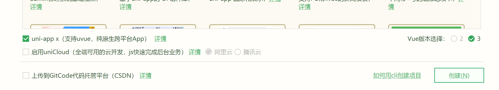
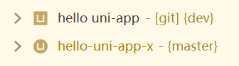
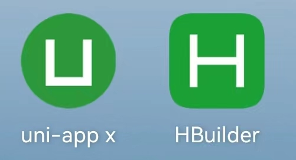

# uni-app x项目

## 新建
在HBuilder3.9起，新建uni-app项目界面的底部有一个checkbox：uni-app x。勾选后会新建为uni-app x项目。



uni-app x不支持vue2，所以无法同时勾选vue2。

uni-app x的项目，manifest.json中会多一个节点`"uni-app-x" : {}`。这是HBuilder识别项目类型的标记。如手动增删这个节点，需对项目点右键"重新识别项目类型"
```json
{
    "name" : "hello-uniapp x",
    "appid" : "__UNI__4517034",
    "description" : "",
    "versionName" : "1.0.0",
    "versionCode" : "100",
    "uni-app-x" : {
    }
}
```

uni-app x的项目，在左侧项目管理器的图标是圆形的U（之前是方型的U）。



## 项目结构

uni-app x的项目结构与[uni-app老版的项目结构](https://uniapp.dcloud.net.cn/tutorial/project.html)基本一致。

主要的差别是没有nativeplugins目录。原因是uni-app x不支持App原生语言插件，仅支持uts插件。

基于uts的插件，可以在uni-app x和uni-app上通用。

uni-app x的App平台也不支持微信小程序wxml组件。

<pre v-pre="" data-lang="">
	<code class="lang-" style="padding:0">
┌─uniCloud              云空间目录，支付宝小程序云为uniCloud-alipay，阿里云为uniCloud-aliyun，腾讯云为uniCloud-tcb（详见<a href="https://doc.dcloud.net.cn/uniCloud/quickstart?structure&id=structure">uniCloud</a>）
│─components            符合vue组件规范的uni-app x组件目录
│  └─comp-a.vue         可复用的a组件
├─utssdk                存放uts文件（已废弃）
├─pages                 业务页面文件存放的目录
│  ├─index
│  │  └─index.uvue      index页面
│  └─list
│     └─list.uvue       list页面
├─static                存放应用引用的本地静态资源（如图片、字体、音视频等）的目录，<b>注意：</b>静态资源都应存放于此目录  <a href="https://doc.dcloud.net.cn/uni-app-x/compiler/#static">详见</a>
├─uni_modules           存放uni_module <a href="https://uniapp.dcloud.net.cn/plugin/uni_modules.html">详见</a>
├─platforms             存放各平台专用页面的目录，<a href="https://uniapp.dcloud.net.cn/tutorial/platform.html#preprocessor">详见</a>
├─nativeResources       App端原生资源目录
│  ├─android            Android原生资源目录 <a href="https://uniapp.dcloud.net.cn/tutorial/app-nativeresource-android">详见</a>
|  └─ios                iOS原生资源目录 <a href="https://uniapp.dcloud.net.cn/tutorial/app-nativeresource-ios.html#%E8%B5%84%E6%BA%90%E6%96%87%E4%BB%B6-bundle-resources">详见</a>
├─hybrid                App端存放web-view组件使用的本地html文件的目录，<a href="./component/web-view">详见</a>
├─wxcomponents          微信小程序平台wxml组件专用目录
├─unpackage             非工程代码，一般存放运行或发行的编译结果、App自定义基座。默认应配置git忽略
├─main.uts              Vue初始化入口文件
├─App.uvue              应用配置，用来配置App全局样式以及监听 <a href="/collocation/App#应用生命周期">详见</a>
├─pages.json            配置页面路由、导航条、选项卡等页面类信息，<a href="/collocation/pages">详见</a>
├─manifest.json         配置应用名称、appid、logo、版本等打包信息，<a href="/collocation/manifest">详见</a>
├─AndroidManifest.xml   Android原生应用清单文件 <a href="https://uniapp.dcloud.net.cn/tutorial/app-nativeresource-android">详见</a>
├─Info.plist            iOS原生应用配置文件 <a href="https://uniapp.dcloud.net.cn/tutorial/app-nativeresource-ios">详见</a>
└─uni.scss              内置的常用样式变量
	</code>
</pre>

## 运行时的UniApp实例

每个uni-app x应用启动，会有一个UniApp实例，通过全局API `getApp()` 获取。

UniApp上有应用级的方法和属性。[详见](./api/get-app.md)

## App的运行和发行

uni-app x的真机运行基座（playground），和 uni-app/5+App/wap2app 不同，是一个绿色圆形的U（之前是方型H），基座名称默认为`uni-app x`（之前叫HBuilder）。


- uni-app x基座，只能运行uni-app x项目，包名是io.dcloud.uniappx
- HBuilder基座，可以运行uni-app/5+App/wap2app。包名是io.dcloud.HBuilder

标准基座使用的图标、包名、证书以及配置的三方sdk的appkey等各种原生信息，都是DCloud的。

当需要使用自己的包名、证书、原生配置以及变更三方原生sdk时，需在打包界面勾选打包自定义基座，打包后的自定义基座会放置在项目的unpackage目录下，然后在运行项目时的界面中可以选择自定义基座来运行。

uni-app x运行时，控制台右上角可以选择开启原生日志。

目前支持真机运行、从HBuilderX 4.0起支持uts插件的debug断点。目前iOS的uvue页面可以断点，Android还不支持uvue的断点debug。

uni-app x App平台，不支持wgt热更新、不支持安心打包。下载到项目下的uts插件可打包含入。

## web的运行和发行注意

uni-app x运行到浏览器时，编译基于vite，其特点是按需编译。所以项目运行后很快能看到首页，但点击二级页时有等待延迟，因为此时正在先编译后再渲染。

这带来2个问题：
1. 运行时点击初次打开的二级页有等待过程。在一个运行的周期内，已编译过的页面再次进入时瞬间打开。
2. 运行后未点到页面由于不会被编译，其中隐藏的类型错误不可知，需在发行时查阅。

发行时会编译全部项目。因为运行时未必点全所有页面，所以发行时可能看到更多编译报错。另外发行后由于已编译过，打开二级页面时很快。

发行后的文件如果部署uniCloud的前端网页托管，记得在uniCloud的web控制台点强制刷新。

如果有条件的话，可以在重新部署后用各地ip访问一遍，让文件同步到各地的cdn节点，这样当地用户第一次访问时就会更快。
